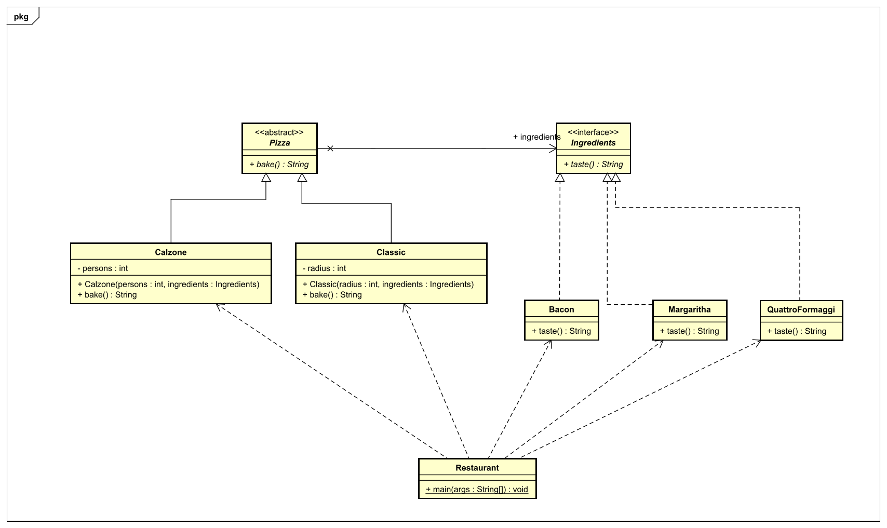

Anstatt dem 0815 Beispiel welches überall benutzt wird mit  Formen und Füllungen  ([1](https://www.tutorialspoint.com/design_pattern/bridge_pattern.htm) [2](https://www.journaldev.com/1491/bridge-design-pattern-java) [3](https://www.baeldung.com/java-bridge-pattern)) habe ich das Bridge-Pattern benutzt um Pizzen zu backen. Man kann hier eine Pizza erstellen, etwa Calzone oder Classic (rund) und dann dieser dann eine Füllung geben. Der Aufrufer muss sich dabei nicht mehr kümmern wie die Füllung für die einzelnen Pizzen gehandhabt wird (der Aufruf wird "gebridged").

 